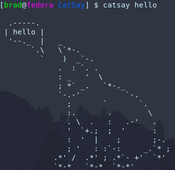
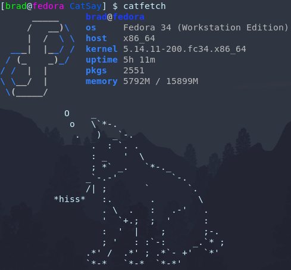

# CatSay
It's cowsay, but a cat! ^w^

## Demo

### Default (no arguments)

### Hello! (arguments)

### Go fetch! (no arguments)

### Speak! (arguments)

## Installation
- To install catsay and catfetch, use `sudo make install`
- To uninstall, use `sudo make uninstall`
- To compile from source, just use `make`
